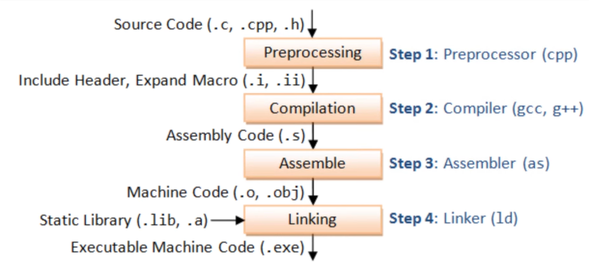
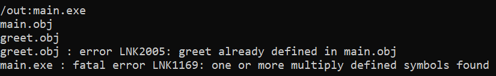
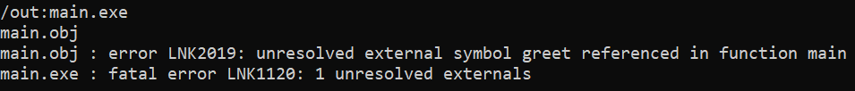

# 00. Intro to C/C++
- C and C++ are two different languages. 
  - **C++ is NOT a superset of C.**
  - However, they are intercompatible to each other:
    - C++ maintains full compatibility with C: C++ compiler shall be able to deal with C code.
    - C++ code with some wrapping stuff can also be compiled by C compiler.
  - <details>
      <summary>Festures & Concepts</summary>
      - function
    - data type
    - header
    - source file
    - variatic function
    - struct
    - library
    - class, OOP
    - interface
    - template
    - standard library
    </details>

- C/C++ needs to be compiled into binary application before being executed, while Python interprets code lines during execution. Therefore, C/C++ application runs much quicker and with much lower memory consumptions.
  - **Compiler (C/C++):** transforms the "human-readable" source code we've written into "machine executable" binary application. "executable" means it can be handled directly by the machine i.e. the OS. 
    > What being executed are these generated binary exe files, not what we've written. The source code we've written just tells machine (or IDE) how to build these applications.
  - **Interpreter (Python):** reads the source file at the execution time, tries to "understand" what to do. All the code is read and interpreted in the runtime.
- Python can serve to "automate" C++ steps

# 01. Install stuffs
- Python, pip
- OpenJDK
- Git
- VSCode
- Visual Studio
# 02. Your first C program
- Write a .c script with text editor
  ```c
  int main()
  {
      printf("Hello");
      printf(" World!");
  }
  ```
- save the text as `simpleC.c` file, i.e. the source code script.
- open a **Windows Terminal** and select the mode as **Developer Command Prompt for VS 2017** via search bar, cd to the C script's directory
- in cmd prompt use `cl` to compile:
  ```bash
  cl simpleC.c
  ```

  > In case we run the compile directly in *native*  **Developer Command Prompt for VS 2017** or **Windows Powershell**, we would get error message below, since the complier is confused.  
  
  <details>
    <summary> Error message (notice that the compiler here is x86 instead of x64) </summary>
      ```
      C:\Users\SLOFUJ7\Desktop\cpp_learning\01_simpleC>cl simpleC.c
      Microsoft (R) C/C++ Optimizing Compiler Version 19.16.27049 for x86
      Copyright (C) Microsoft Corporation.  All rights reserved.

      simpleC.c
      Microsoft (R) Incremental Linker Version 14.16.27049.0
      Copyright (C) Microsoft Corporation.  All rights reserved.

      /out:simpleC.exe
      simpleC.obj
      simpleC.obj : error LNK2019: unresolved external symbol _printf referenced in function _main
      simpleC.exe : fatal error LNK1120: 1 unresolved externals
      ```
  </details>  

  <br>

  > Solution: use **x64 Native Tools Command Prompt for VS 2017** as native cmd prompt.

  And should get following message:
  ```
  C:\Users\SLOFUJ7\Desktop\cpp_learning\01_simpleC>cl simpleC.c
  Microsoft (R) C/C++ Optimizing Compiler Version 19.16.27049 for x64
  Copyright (C) Microsoft Corporation.  All rights reserved.

  simpleC.c
  Microsoft (R) Incremental Linker Version 14.16.27049.0
  Copyright (C) Microsoft Corporation.  All rights reserved.

  /out:simpleC.exe
  simpleC.obj

  ```
  which means the compile process successed. Now we have
  - simpleC.obj
  - simpleC.exe  
  
  besides the script
  - simpleC.c
  
  in the folder.

    
- run the `.exe` in cmd prompt
  ```bash
  simpleC.exe
  ```
  we will get the printed message
  ```
  C:\Users\SLOFUJ7\Desktop\cpp_learning\01_simpleC>simpleC.exe
  Hello World!
  ```
  > Double click the `.exe` in the folder doesn't show the printed string, because this behavior calls a new cmd prompt, execute the application and shut down the cmd promt directly after the execution.  
  It works actually, but just show in few ms so we couldn't see it properly.


# 03. Understanding the toolchain
As shown in 02, the compile process fails in native cmd prompts, but successed in *Windows Terminal* and *x64 Native Tools Command Prompt*. This behavior could be odd... Now in this part we try to understand the toolchain.  
<br>  

## 3.1 What happens during compiling?

<div align=center>
  
</div>

>**Preprocessor**:  
Copy and paste stuff around, replace stuff in your source file, in a "virtual" way. Basically it transforms the source code into the version that is then supplied to the compiler.

And what generated after `cl simpleC.c` command:
- simpleC.obj
- simpleC.exe

***

## 3.2 Split the function into another script
### <3.2.1> without "include"
`simpleC.c`: contains the main() function  
```c
int main()
{
  greet();
}
```
`greet.c`: do the printf
```c
void greet()
{
  printf("Hello ");
  printf("World!");
}
```
in cmd prompt:
```bash
cl simpleC.c greet.c
```
output:
- simpleC.obj
- greet.obj
- simpleC.exe
<br>  
***

### <3.2.2> use "include"
`simpleC.c`: contains the main() function  
```c
#include "greet.c"

int main()
{
  greet();
}
```
`greet.c`: do the printf
```c
void greet()
{
  printf("Hello ");
  printf("World!");
}
```
in cmd prompt:
```bash
cl simpleC.c
```
output:
- simpleC.obj
- simpleC.exe
<br>
***
<br>

### Summary:
|     cmd      | Without "include" | Use "include" |
|--------------|-------------------|---------------|
| cl both `.c` |**Success**<br>-simpleC.obj<br>-greet.obj<br>-simpleC.exe|**ERROR:** multiply defined<br>|
| cl only `main.c` |**ERROR:** unresolvable<br>|**Success**<br>-simpleC.obj<br>-simpleC.exe|
| | | |

## 3.3 Try C++ compiler
C++ compiler is not so "flexible"...